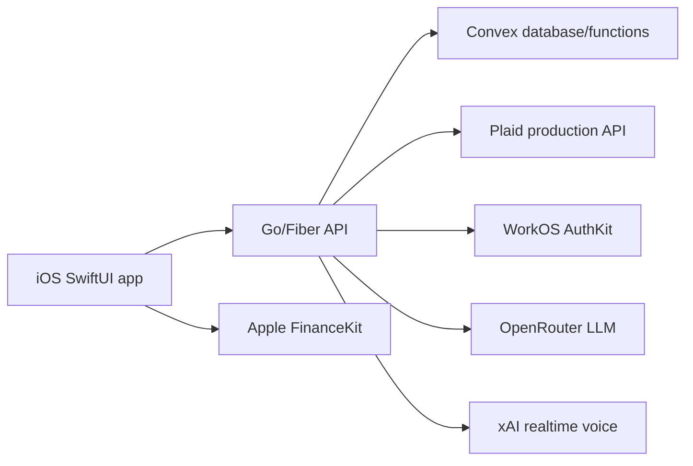

# Budget App

Native iOS budgeting app with a Go/Fiber API, Convex persistence, Plaid production bank linking, WorkOS AuthKit authentication, and OpenRouter/xAI-assisted finance features.

The product goal is a premium iOS budgeting experience: Apple-like navigation and charts, automatic bank sync, manual/statement accounts, budget classification, receipt-level detail, cashflow planning, and finance-aware AI assistance.

## Current Architecture



## Repository Layout

- `ios/BudgetApp`: SwiftUI iOS app and Xcode project.
- `backend`: Go 1.25 API using Fiber, Plaid REST, WorkOS SDK, OpenRouter, xAI, and Convex HTTP function calls.
- `convex`: Convex schema and functions for users, connections, accounts, transactions, budgets, receipts, statements, goals, and assistant conversations.
- `package.json`: Convex CLI scripts.
- `.env.example`: Non-secret environment variable template.

## Environment

Create `.env` at the repository root. Do not commit `.env` or `.env.local`.

Required for normal local development:

```sh
PORT=8080
PLAID_ENV=production
PLAID_CLIENT_ID=your-plaid-client-id
PLAID_SECRET_PROD=your-plaid-production-secret
TOKEN_ENCRYPTION_KEY=base64-encoded-32-byte-key
CONVEX_DEPLOYMENT=prod:your-convex-deployment
CONVEX_DEPLOYMENT_KEY=your-convex-deploy-key
WORKOS_CLIENT_ID=your-workos-client-id
WORKOS_API_KEY=your-workos-api-key
WORKOS_REDIRECT_URI=budgetapp://auth/callback
OPENROUTER_API_KEY=your-openrouter-key
OPENROUTER_MODEL=openai/gpt-5.5
XAI_API_KEY=your-xai-key
XAI_VOICE_MODEL=grok-voice-fast-1.0
XAI_VOICE=Eve
```

Generate the token encryption key with:

```sh
openssl rand -base64 32
```

## Convex

Install dependencies:

```sh
npm install
```

Run codegen after schema/function changes:

```sh
npm run convex:codegen
```

Deploy functions/schema:

```sh
npm run convex:deploy
```

For local Convex development:

```sh
npm run convex:dev
```

The Go API expects `CONVEX_DEPLOYMENT` or `CONVEX_URL` plus `CONVEX_DEPLOYMENT_KEY`. The app currently accesses Convex through the Go API rather than directly from Swift.

## Backend

Run locally:

```sh
cd backend
go run ./cmd/api
```

Validate:

```sh
curl http://localhost:8080/health
```

Build/test:

```sh
cd backend
go test ./...
go build ./cmd/api
```

### Important API Routes

- `GET /health`
- `GET /v1/accounts?user_id=...`
- `POST /v1/accounts/manual`
- `DELETE /v1/accounts/:id?user_id=...`
- `GET /v1/transactions?user_id=...&limit=...&q=...`
- `POST /v1/transactions/manual`
- `PATCH /v1/transactions/:id/category`
- `GET /v1/budgets?user_id=...`
- `POST /v1/budgets`
- `PUT /v1/budgets/:id`
- `DELETE /v1/budgets/:id?user_id=...`
- `POST /v1/budgets/autogenerate`
- `POST /v1/budgets/assistant/chat`
- `GET /v1/assistant/conversations?user_id=...`
- `POST /v1/assistant/conversations`
- `GET /v1/assistant/conversations/:id/messages?user_id=...`
- `POST /v1/assistant/chat/stream`
- `POST /v1/voice/xai/client-secret`
- `POST /v1/plaid/link-token`
- `POST /v1/plaid/exchange-public-token`
- `POST /v1/plaid/sync`
- `POST /v1/plaid/items/:id/sync`
- `POST /v1/plaid/webhook`
- `POST /v1/statements/import-csv`
- `POST /v1/statements/import-pdf`
- `POST /v1/financekit/import`

## iOS

Open the project:

```sh
open ios/BudgetApp/BudgetApp.xcodeproj
```

The current development endpoint is configured in `ios/BudgetApp/Sources/BudgetApp/Networking/APIClient.swift`. For a physical iPhone, `localhost` means the phone, not the Mac. Use the Mac LAN IP, e.g.:

```swift
APIClient(baseURL: URL(string: "http://192.168.x.x:8080/v1")!, userID: BudgetAuthStorage.savedUserID ?? "local-user")
```

Build from CLI for a connected device:

```sh
DEVELOPER_DIR=/Applications/Xcode.app/Contents/Developer \
  xcodebuild \
  -project ios/BudgetApp/BudgetApp.xcodeproj \
  -scheme BudgetApp \
  -destination 'id=YOUR_DEVICE_ID' \
  -configuration Debug \
  build
```

Install after build. Prefer the repository helper so the app is always installed from a fresh DerivedData product instead of a stale `ios/BudgetApp/build` artifact:

```sh
scripts/install-ios-build.sh simulator
scripts/install-ios-build.sh device YOUR_DEVICE_ID
```

Manual install after build:

```sh
DEVELOPER_DIR=/Applications/Xcode.app/Contents/Developer \
  xcrun devicectl device install app \
  --device YOUR_DEVICE_ID \
  ~/Library/Developer/Xcode/DerivedData/BudgetApp-*/Build/Products/Debug-iphoneos/BudgetApp.app
```

## Implemented Product Areas

- WorkOS sign-in flow with local session persistence and targeted adoption of pre-auth local account data.
- Plaid Link token creation and public-token exchange.
- Plaid transaction sync with fast incremental refresh and explicit 12-month historical backfill.
- Convex-backed accounts, provider connections, encrypted Plaid item storage, transactions, observations, categories, budgets, budget income overrides, goals, statements, receipts, and assistant conversations.
- Activity tab with search/filter support and pull-to-refresh that triggers Plaid sync.
- Cashflow tab with Health-style period selector, horizontally scrollable trend, selected-day details, and category drilldown.
- Budgets tab with month navigation, synced income detection/review decisions, budget category cards, category transaction assignment, budget editor, and Budget AI proposal/review/apply assistant.
- Finance assistant chat with conversations, streaming text responses, Markdown rendering, and xAI realtime voice plumbing.
- Statement import for CSV and PDF upload path.
- FinanceKit import surface, native entitlement wiring, and backend route.

## Known Limitations / Next Work

- FinanceKit entitlement is configured in the app target, but each development/build machine still needs a refreshed provisioning profile that includes `com.apple.developer.financekit`.
- Budget AI persists pending review plans and proposal history in Convex; next step is undo/reapply affordances and a clearer per-action diff before apply.
- Plaid backfill is explicit from the Profile sync section; next step is richer per-item status and failed-item retry UI.
- Receipt OCR and line-item classification need a full review/apply workflow.
- Authorization is still mostly enforced by user key routing through the Go API. Harden API auth middleware before production.
- Secrets are intentionally not in the repo. Keep `.env`, `.env.local`, bank statement samples, build artifacts, and derived data ignored.

## Data Model Notes

Convex is the source of truth. Key relationships:

- `users`: WorkOS or legacy user identity.
- `connections`: provider connection, e.g. Plaid item or FinanceKit import source, including sync cursor and historical backfill marker.
- `providerSecrets`: encrypted provider payloads such as Plaid access tokens.
- `accounts`: normalized user-facing account records.
- `providerAccounts`: provider-specific account identities linked to accounts.
- `transactions`: normalized financial events shown in the app.
- `transactionObservations`: raw provider observations used for dedupe/matching.
- `transactionMatches`: links multiple provider observations to one normalized transaction.
- `receipts` and `receiptLineItems`: receipt metadata and item-level categorization.
- `categories`, `categoryRules`, `budgets`, `budgetIncomeOverrides`, `budgetAssistantProposals`: budgeting, classification, user-reviewed income detection, and pending AI budget plans.
- `assistantConversations`, `assistantMessages`: persisted finance-chat threads.

When a user signs into WorkOS after linking data locally, the iOS app sends the previous local `user_id` to the Go callback. The API calls `finance:legacyAdoptMissingUserData`, which moves only missing account/provider/transaction records into the WorkOS profile and skips account rows that already exist by source/type/subtype/name.

## Security Notes

- Never commit `.env`, `.env.local`, Plaid secrets, WorkOS keys, OpenRouter keys, xAI keys, Convex deploy keys, token encryption keys, or real statements.
- Do not move provider secrets to the iOS client. Provider keys belong behind the Go API.
- Access tokens are encrypted before storage. Changing `TOKEN_ENCRYPTION_KEY` will make previously stored encrypted Plaid tokens unreadable.
